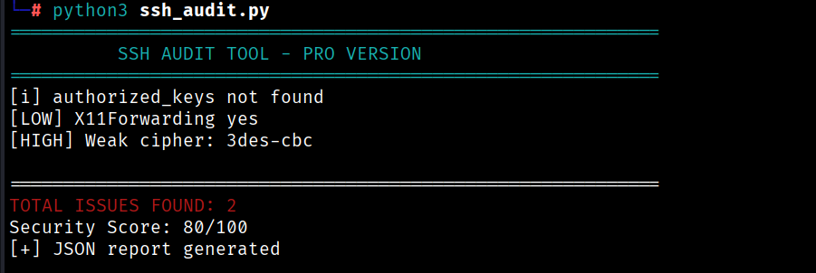
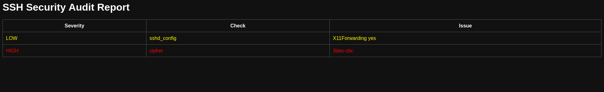

# 🔐 SSH Audit Tool

SSH Audit Tool is a lightweight Python-based SSH security auditing tool that detects misconfigurations, weak ciphers, and permission issues — generating detailed JSON and HTML reports with a security scoring system.
Designed for learning, labs, and real-world Linux environments.

## 🚀 Features

- Detects dangerous sshd_config settings (PermitRootLogin, PasswordAuthentication, etc.)
- Validates authorized_keys file permissions
- Detects weak ciphers (3DES-CBC, Arcfour)
- Severity tagging — HIGH / MEDIUM / LOW
- Security Score out of 100
- Generates JSON and HTML reports
- Color-coded terminal output
- CLI support (`--html` flag)

## ⚙️ Installation

```bash
git clone https://github.com/VishalXsec/ssh-audit-tool.git
cd ssh-audit-tool
pip install colorama
```

## ⚡ Quick Start

```bash
python3 ssh_audit.py
```

## 🧪 Usage

**Basic scan:**
```bash
python3 ssh_audit.py
```

**Scan + HTML Report:**
```bash
python3 ssh_audit.py --html
```

## 📊 Example Output



============================================================
SSH AUDIT TOOL - PRO VERSION
[i] authorized_keys not found
[LOW]  X11Forwarding yes
[HIGH] Weak cipher: 3des-cbc
============================================================
TOTAL ISSUES FOUND: 2
Security Score: 80/100
[+] JSON report generated
[+] HTML report generated

## 📄 Report

SSH Audit Tool generates two types of reports:
reports/report.json    # Machine-readable JSON
reports/report.html    # Human-readable HTML dashboard



## 📁 Project Structure
ssh-audit-tool/
├── ssh_audit.py        # Main entry point
├── README.md           # Documentation
├── .gitignore
├── checks/
│   ├── init.py
│   ├── config.py       # sshd_config checker
│   ├── permissions.py  # File permission checker
│   └── cipher.py       # Weak cipher detector
└── reports/
├── report.json
└── report.html

## ⚠️ Disclaimer

This tool is intended for educational purposes and authorized security auditing only. Do not use it on systems without proper permission.

## 👨‍💻 Author

**Vishal Prasad**
[GitHub](https://github.com/VishalXsec) • [LinkedIn](https://linkedin.com/in/vishalprasad10) • [TryHackMe](https://tryhackme.com/p/vishal10)
